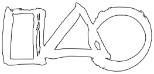

Source code repository for the **stc** game.

## The Game

Place objects to their positions in a relaxing 2D physics puzzle game.

The current version 1.0 provides 100 levels. This number may be increased in next versions.

## Controls

* Mouse and LMB (desktop and HTML) / tap (mobile) - activate controls and place objects
* Esc - back
* R - retry level

## Homepage and Download

* at [itch.io](https://rado1.itch.io/stc)

## Development

Checkout the git repository and open it in Godot editor.

The repository contains also a tool to export screenshots of all existing levels. It is activated by running the tools/screenshooter_start.tscn scene.

The code structuring enables quite easy creation of new levels, rooms with specific shapes and gravity, or even new object types.

## Feedback

Create an issue to report ideas about new levels, improvements, extensions, or reporting bugs. Your feedback is welcome!

## Technologies and Assets

* Engine: [Godot](https://godotengine.org/) 3.5.1
* Music: [Sirens in Darkness](https://opengameart.org/content/sirens-in-darkness) by The Cynic Project / pixelsphere.org / cynicmusic.com
* Speech generated by: [Speechify](https://speechify.com/)
